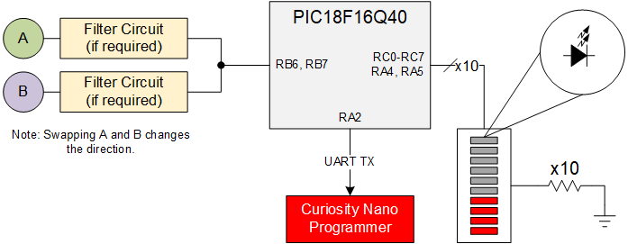
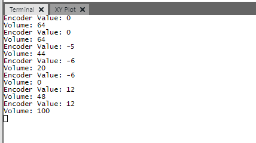
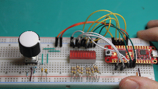
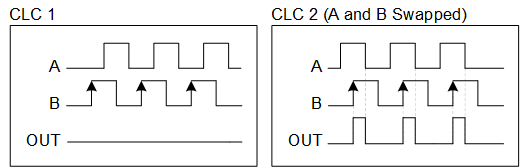
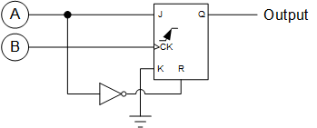
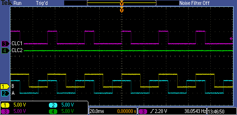
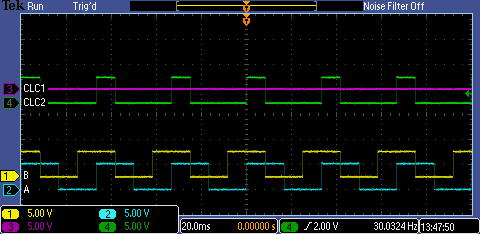

# Quadrature Decoder with PIC18F16Q40

This code example creates a simple quadrature decoder on the PIC18F16Q40 device. It utilizes 2 of the Configurable Logic Cells (CLCs) and TMR1/2/3 to decode the quadrature output of the rotary encoder. A UART interface is also used for a serial readout.

## Related Documentation

* [Datasheet for PIC18F16Q40 Devices {to be published soon}](#)
* [AN2434, Interfacing Quadrature Encoder using CCL with TCA and TCB](http://www.microchip.com//wwwAppNotes/AppNotes.aspx?appnote=en599697)
* [Quadrature Encoder Example on AVR DB {to be published soon}](https://github.com/microchip-pic-avr-examples/avr128db48-quadrature-decoder.git)

## Software Used

* [MPLAB X v5.40](https://www.microchip.com/mplab/mplab-x-ide)
* [XC8 v2.30](https://www.microchip.com/en-us/development-tools-tools-and-software/mplab-xc-compilers)
* [MPLAB Code Configurator v5.0.1](https://www.microchip.com/mplab/mplab-code-configurator)
* [PIC18F-Q_DFP v1.8.154](https://packs.download.microchip.com/)
* [MPLAB Data Visualizer](https://www.microchip.com/mplab/mplab-data-visualizer) or a Serial COM Terminal (*optional*)

## Hardware Used

* [PIC18F16Q40 Curiosity Nano (PN: EV70C97A)](#)
* [PIC18F16Q40 Curiosity LPC, Rev 4 (PN: DM164137)](#https://www.microchip.com/DevelopmentTools/ProductDetails/PartNO/DM164137)
* [PIC18F16Q40 Device Information](https://www.microchip.com/wwwproducts/en/PIC18F16Q40)
* Incremental Encoder
* Components required for Encoder Filtering Circuit (if applicable)

### LED Bar Graph Supplies *(optional)*

* LED Bar Graph display with 10 segments
* 10 resistors for current limiting the LED display
  * Value of the resistor depends on the desired brightness, wavelength, and operating Vdd.

### Example Wiring  
  

## Setup  

  

| Pin Name | Function
| -------- | --------
| RB7      | UART TX Output (115,200 Baud)
| RB5      | UART RX Input (Unused)
| RB4      | Encoder "A" Input
| RB6      | Encoder "B" Input
| RA5      | LED "Volume" Output 10
| RA4      | LED "Volume" Output 9
| RC7-RC0  | LED "Volume" Outputs (1 - 8)

Note: To Reverse Direction, Swap "A" and "B" lines on the encoder.

### Encoder Wiring and Setup

Depending on the encoder, the specific circuit required for proper operation will vary. The manufacturer of the device will specify the circuits required to interface with the device.

## Operation

This example has 2 outputs - a UART output and an LED graphical display output.

The UART output runs at 115,200 baud which prints the net change in encoder value (over a period of 1 second) and the current volume of the program.
The LED graph display output uses a 10-position LED bar graph to display the current volume.

### UART Output

The UART output operates at a baud rate of 115,200 through the programmer to the PC. [MPLAB Data Visualizer](https://www.microchip.com/mplab/mplab-data-visualizer) can be used to visualize the serial output. After plugging in the board, select the COM port, but do not connect to it. In the bottom left corner Data Visualizer Window/Tab, enter the following settings.

* Baud Rate: 115,200
* Char Length: 8 bits
* Parity: None
* Stop Bits: 1 bit

After setting these options, press apply, then connect to the COM port. In the terminal window, set the display to 8-bit ASCII, the source to the connected COM port, and wait. Within a few seconds, text should start printing to the screen.

### LED Bar Graph Output

The LED bar graph is a graphical "volume" style output. Each bar graph is worth 10, with the exception of the first and last segments which represent 0% and 100%. The Macros in `volume.h` can be used to change the way volume is adjusted.

Note: Due to differences in encoder parameters, some of the constants will have to be tweaked to find the right balance of speed and accuracy with the Volume.

#### Control options

* Linear - Each pulse from the encoder is counted as 1
* Threshold - After exceeding a threshold, in this case 3 pulses, each pulse is worth the same as a "1 rotation pulse".
* 1 Rotation - Each pulse is worth approximately the value required for a single rotation to adjust from 0 to 100.

## Theory of Operation

The quadrature decoder takes 2 inputs, A and B, that are out-of-phase by 90 degrees. One of the inputs is considered a reference waveform, for which the phase of the other is measured against. The other waveform determines the direction of the encoder based on if it leads or lags the reference, as shown below.

This phase difference can be utilized by the Configurable Logic Cells (CLCs) on the PIC18F16Q40 in JK Flip-Flop mode. The JK flip-flop is a clocked gate - meaning that it only applies the inputs (J and K) to the output (Q) on the rising edge of the clock. The truth table for the JK Flip-Flop is reproduced below.

| J   | K   | Q
| --- | --- | ---
| 0   | 0   | Q
| 0   | 1   | 0
| 1   | 0   | 1
| 1   | 1   | ~Q

The reset lines in this implementation operate asynchronously - if the line is high, then Q immediately goes to 0. In the CLC, one of the input lines (A or B) is used as a clock line while the other is used as the input to set and clear the flip-flop, as shown below.

There are 2 CLCs used in this project, with the only difference being that A and B are swapped between the two. Swapping A and B causes one of the CLCs to see the input lag while the other sees the input lead. In a JK flip-flop, J must be high when the clock is rising in order to set the output high. The only flip-flop that will be set is the configuration where the input leads the clock signal, as shown in the images below.

Both images were taken with a test signal of ~30Hz. Between runs, the wires to A and B were switched, causing 1 CLC to become active while the other becomes inactive. The output of the CLCs is internally routed to either TMR1 or TMR3. The rising edge of the output causes the timer to count. Normally the TMR1 or TMR3 peripherals are used as an interrupt, however since the pulse count is unknown and is likely to be relatively small, it makes more sense to use a timer (such as TMR2) as an interrupt to poll the number of pulses in each.

The simple way to get the number of pulses in TMR1/3 is to stop the timer, read the value, reset the counter to 0, and start it again. However, if a pulse occurs, then it will be missed by the timer. A better approach is to use the relative difference between each polling event. If the encoder was spun in the same direction between each polling event, then the difference in values (current to old) will be 0, while the other will change. If the direction of rotation was changed between polling events, then both counters will have non-zero differences.

To find the net direction of rotation, subtract the net change of one of the timers from the other. The sign of this value indicates whether the encoder is turning clockwise or counter-clockwise. The magnitude of this value represents (approximately) how far it has rotated.

## Summary
In this example, a quadrature decoder was almost entirely implemented in hardware on the PIC18F16Q40 device. This implementation minimizes the amount of software required, freeing up the CPU to perform other tasks. This code example can be adapted to fit the needs of the system - with a few tweaks, this example could become an I2C target or this example could become the primary microcontroller of the entire system.
