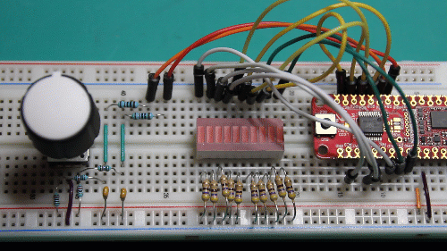

# Quadrature Decoder with PIC18F16Q40

This code example creates a simple quadrature decoder on the PIC18F16Q40 device. It utilizes 2 of the Configurable Logic Cells (CLCs) and TMR1/2/3 to decode the quadrature output of the rotary encoder. A UART interface is also used for a serial readout.

## Related Documentation

* [PDF Datasheet for PIC18F16Q40](http://ww1.microchip.com/downloads/en/DeviceDoc/PIC18F06-16Q40-Data-Sheet-40002216C.pdf)  
* [Online Datasheet for PIC18F16Q40](http://onlinedocs.microchip.com/pr/GUID-73B9A526-A001-4F01-ABC8-DBB48A2A12E6-en-US-10/index.html)  

## Software Used

* [MPLAB X v5.45](https://www.microchip.com/mplab/mplab-x-ide?utm_campaign=PIC18FQ40&utm_source=GitHub&utm_medium=hyperlink&utm_term=&utm_content=pic18f16q40-quadrature-decoder-MCU8_MMTCha)
* [XC8 v2.31](https://www.microchip.com/en-us/development-tools-tools-and-software/mplab-xc-compilers?utm_campaign=PIC18FQ40&utm_source=GitHub&utm_medium=hyperlink&utm_term=&utm_content=pic18f16q40-quadrature-decoder-MCU8_MMTCha)
* [MPLAB Code Configurator (MCC) v4.1](https://www.microchip.com/mplab/mplab-code-configurator?utm_campaign=PIC18FQ40&utm_source=GitHub&utm_medium=hyperlink&utm_term=&utm_content=pic18f16q40-quadrature-decoder-MCU8_MMTCha)
  * [Melody Library v1.37.18](https://www.microchip.com/mplab/mplab-code-configurator?utm_campaign=PIC18FQ40&utm_source=GitHub&utm_medium=hyperlink&utm_term=&utm_content=pic18f16q40-quadrature-decoder-MCU8_MMTCha)
* [PIC18F-Q_DFP v1.9.175](https://packs.download.microchip.com/?utm_campaign=PIC18FQ40&utm_source=GitHub&utm_medium=hyperlink&utm_term=&utm_content=pic18f16q40-quadrature-decoder-MCU8_MMTCha)
* [MPLAB Data Visualizer](https://www.microchip.com/mplab/mplab-data-visualizer?utm_campaign=PIC18FQ40&utm_source=GitHub&utm_medium=hyperlink&utm_term=&utm_content=pic18f16q40-quadrature-decoder-MCU8_MMTCha) or a Serial COM Terminal (*optional*)

## Hardware Used

* [PIC18F16Q40 Curiosity Nano (PN: EV70C97A)](https://www.microchip.com/developmenttools/ProductDetails/EV70C97A?utm_source=GitHub&utm_medium=text&utm_campaign=pic18Q40&utm_content=MCU8_MMTCha_Q40QuadratureDecoderExample)
* [PIC18F16Q40 Device Information](https://www.microchip.com/wwwproducts/en/PIC18F16Q40?utm_campaign=PIC18FQ40&utm_source=GitHub&utm_medium=hyperlink&utm_term=&utm_content=pic18f16q40-quadrature-decoder-MCU8_MMTCha)
* Incremental Encoder (In this example, PEC12R-4225F-N0024)
* Components required for Encoder Filtering Circuit (if applicable)

### LED Bar Graph Output - Required Parts *(optional)*

* LED Bar Graph display with 10 segments (In this example, LTA-1000HR)
* 10 resistors for current limiting the LED display.
  * For this example, 470 ohm resistors were used at an operating voltage of 5V.  

Note: Value of the resistor depends on the desired brightness, wavelength, and operating voltage.

### Example Wiring

  
*Figure 1 - Setup used for testing. Your setup may vary.*

## Setup

*Figure 2 - Block Diagram of the System*

| Pin Name | Function
| -------- | --------
| RB7      | UART TX Output (115,200 Baud)
| RB5      | UART RX Input (Unused)
| RB4      | Encoder "A" Input
| RB6      | Encoder "B" Input
| RA5      | LED Output 10
| RA4      | LED Output 9
| RC7-RC0  | LED Outputs ( 1 to 8 )

Note: To Reverse Direction, Swap "A" and "B" lines on the encoder.

### Encoder Wiring and Demo Setup

Depending on the encoder, the specific circuit required for proper operation will vary. The manufacturer of the device will specify the circuits required to interface with the device.

***

The encoder used is a mechanical encoder with 24 pulses-per-revolution (PPR). High PPR encoders provide more precise positioning information. However, this example uses it for user interfacing, where the precision of a higher PPR encoder was not needed.

To connect the encoder to the microcontroller, the manufacturer for this encoder (Bourns Inc.) recommends pulling up the outputs of the encoders to Vdd and filtering with an RC filter, an example of which is shown in Figure 3. (See the [Manufacturer's Datasheet](https://www.bourns.com/docs/Product-Datasheets/PEC12R.pdf) for up-to date information.)

  
*Figure 3 - Implemented Circuit*

10k resistors were added in series with the RC filter to reduce the current through the ESD diodes from the filter capacitor if power is lost while the capacitors are fully charged. Since the encoder signal is digital, the added resistance should have a minimial effect on the performance of the encoders.

Note: Damage may occur if too much current is passed through the ESD diodes.

## Operation

This example has 2 outputs - a UART output and an LED bar graph display output.

The UART output prints the net change in encoder value (over a period of 1s) and the current volume of the program at 115,200 baud.  
The LED graph display output uses a 10-position LED bar graph to display the current volume.

### UART Output

The UART output is connected through the programmer to the PC. [MPLAB Data Visualizer](https://www.microchip.com/mplab/mplab-data-visualizer) can be used to visualize the serial output. After plugging in the board, select the programmer's COM port, but do not connect to it. In the bottom left corner of the Data Visualizer Window/Tab, enter the following settings.

* Baud Rate: 115,200
* Char Length: 8 bits
* Parity: None
* Stop Bits: 1 bit

After setting these options, press apply, then connect to the COM port. In the terminal window, set the display to 8-bit ASCII, the source to the connected COM port, and wait. Within a few seconds, text should start printing to the screen.

*Figure 4 - Example Terminal Output*

### LED Bar Graph Output

The LED bar graph is a graphical "volume" style output. Each bar graph is worth 10, with the exception of the first and last segments which represent 0% and 100%. The Macros in `volume.h` can be used to change the way volume is adjusted (see [Control Options](#control-options)).

*Figure 5 - Demonstration of the LED Bar Graph Output*

Note: Due to differences in encoder parameters, some of the constants may have to be tweaked to find the right balance of speed and accuracy with the Volume Control.

#### Control options

* Linear - Each pulse from the encoder is counted as 1.
* Threshold - After exceeding a threshold, in this case 3 pulses, each pulse is worth the same as a "1 rotation pulse".
* 1 Rotation - Each pulse is worth approximately the value required for a single rotation to go from 0 to 100.

## Theory of Operation

The quadrature decoder takes 2 inputs, A and B, that are out-of-phase by 90 degrees. One of the inputs is considered a reference waveform, for which the phase of the other is measured against. The other waveform determines the direction of the encoder based on if it leads or lags the reference, as shown in Figure 6.

*Figure 6 - Example outputs of the CLCs*

This phase difference can be utilized by the Configurable Logic Cells (CLCs) on the PIC18F16Q40 in JK Flip-Flop mode. The JK flip-flop is a clocked gate - meaning that it only applies the inputs (J and K) to the output (Q) on the rising edge of the clock. The truth table for the JK Flip-Flop is reproduced below.

| J   | K   | Q
| --- | --- | ---
| 0   | 0   | Q
| 0   | 1   | 0
| 1   | 0   | 1
| 1   | 1   | ~Q

The reset lines in this implementation operate asynchronously - if the line is high, then Q immediately goes to 0. In the CLC, one of the input lines (A or B) is used as a clock line while the other is used as the input to set and clear the flip-flop, as shown in Figure 7.

*Figure 7 - CLC Logic Diagram*

There are 2 CLCs used in this project, with the only difference being that A and B are swapped between the two. Swapping A and B causes one of the CLCs to see the input lag while the other sees the input lead. In a JK flip-flop, J must be high when the clock is rising in order to set the output high. The only flip-flop that will be set is the configuration where the input leads the clock signal, as shown in Figures 8 and 9.

*Figure 8 - Output of the CLCs (with A and B not switched)*

*Figure 9 - Output of the CLCs (with A and B switched)*

Both images were taken with a test signal of ~30Hz. Between runs, the wires to A and B were switched, causing 1 CLC to become active while the other becomes inactive. The output of the CLCs is internally routed to either TMR1 or TMR3. The rising edge of the output causes the timer to count. Normally the TMR1 or TMR3 overflow is used as an interrupt, however since the pulse count is unknown and is likely to be relatively small, it makes more sense to use a timer (such as TMR2) as an interrupt to poll the number of pulses in each.

The simple way to get the number of pulses in TMR1/3 is to stop the timer, read the value, reset the counter back to 0, and start it again. However, if a pulse occurs, then it will be missed by the timer. A better approach is to use the relative difference between each polling event. If the encoder was spun in the same direction between each polling event, then the difference in values (current to old) will be 0, while the other will change. If the direction of rotation was changed between polling events, then both counters will have non-zero differences.

To prevent invalid reads, this example uses TMR1 and TMR3 in 16-bit read mode to buffer the high byte of the timer counter when the low byte is read. This mode of operation prevents an increment that could occur after reading the 1st byte from affecting the high byte, as shown in Figure 10.

*Figure 10 - Timing error caused by an asynchronous pulse*

To find the net direction of rotation, subtract the net change of one of the timers from the other. The sign of this value indicates whether the encoder is turning clockwise or counter-clockwise. The magnitude of this value represents (approximately) how far it has rotated.

### CLC Implementation

  
*Figure 11 - CLC 1 Implementation*

  
*Figure 12 - CLC 2 Implementation*  

## Summary
In this example, a quadrature decoder was almost entirely implemented in hardware on the PIC18F16Q40 device. This implementation minimizes the amount of software required, freeing up the CPU to perform other tasks. This code example can be easily tailored for a specific application. The only requirements to implement the quadrature decoder (with no physical outputs or indicators) are 2 CLCs, TMR1, TMR2, and TMR3.
